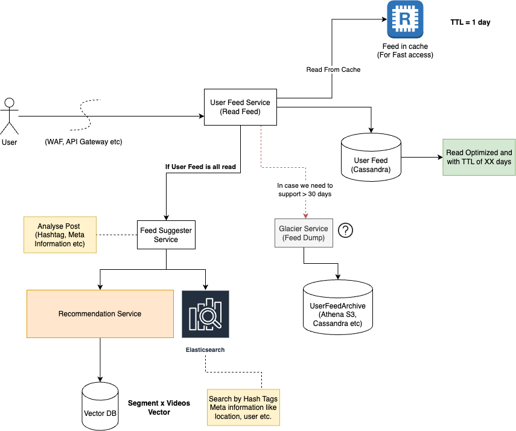

## Instagram System Design

# Problem Statement

Like you to design a scalable and high-performing social media platform similar to Instagram. Your design should focus on the following key features:

- User registration and authentication
- Image and video uploading, storage, and retrieval
- Creating and displaying user profiles, including followers and following lists
- A timeline of content posted by users and their friends, with support for liking and commenting on posts
- A search functionality to find users and hashtags
- Notifications

  

### High Level Design Requirement

Please walk me through your high level design ( HLD )choices, including identification of core systems + sub systems and architectural patterns you would use to **address scalability, performance, and fault tolerance**. Additionally, **discuss any trade-offs** you would consider in your design and how you would validate your decisions with your team.

  

### Low level design Requirement

For managing user timelines, ensuring that the content is displayed in a timely and relevant manner? Please consider the following : 

- Data storage and retrieval
    - What kind of database(s) would you choose to store the posts, user relationships (friends, followers), likes, and comments
    - Discuss your choice of database schema and indexing strategies to optimize read and write performance.
- Ranking and feed generation: 
    - How would you design an algorithm to rank and prioritize the posts in a user's timeline based on factors like recency, user engagement, and relevance? What strategies would you use to ensure this algorithm scales efficient?

  

# Clarification - Functional & Non-Functional

- Functional Requirement
    - Seamless browsing of Users Timeline with Videos and Photos
        - Do we need ads in between?
        - Do we need to maintain feed in chronological manner?
    - Follow & Unfollow Users

    - Like a Post
    - Comments on Post

    - Search Photos and Videos

- Non Functional Requirement
    - Scalablity
        - How many users looking at feed everyday? 
            - Assumed - 1B (Total User Base) - 500M may be the active user base
        - How many videos are getting uploaded everyday?
            - Assumed - 10M videos (30MB) + 20M Photos (1MB)
                - Basis - 2% Users upload videos everyday and 4% upload photos everyday.

    - Storage Req
        - **Without Compression (Raw Image Storage)**
            - 20M photos x 1MB = 20 Million MB = 20TB
            - 10M Videos x 30MB = 300Million MB = 300TB
            - Total Size Per Day = 20 + 300 = 320 TB = ~ 350TB
            - Total Size for a year = 350 TB x 365 = 127,750 TB = 127 PB
        - **Post Compression (Compressed Videos Storage)**
            - Low-quality video: 320x240 pixels

                - Compression ratio: 10:1 (compressed size is 1/10th of the original size)

            - Medium-quality video: 720x480 pixels
                - Compression ratio: 20:1
            - High-quality video:  1920x1080 pixels (Full HD)

                - Compression ratio: 30:1

    - Bandwidth Calculation - For Low Latency
        - CDN charges basis of the bandwidth they are serving and storage capacity used.

    - Fault Tolerance
        - In case feed is not available for current users?
            - Option 1 : Graceful Degradation : We can load the previous stored feed of the users.
            - Option 2: Retry Request In Background : Generally if feed is not loading, customers tends to refresh the page.

# Solution Proposal

## Components - Building Blocks

- CDN - To reduce calls on servers and improve latency to provide seamless experience.
- Cache - For all user path flow, we should try to utilize cache where ever we can.
- Storage - S3 or Similar - To store all raw and processed files. 
- Database (Cassandra, MySQL) - For Storage of user information, metadata of videos & photos etc etc.
- Big Data Infrastructure : For storage of click stream (impressions, clicks, likes etc)
- GPU Based Machines - To power recommendations, search for feed
- Event Based Communication with distributed message queue.
- Lambda Function - To trigger jobs when required

  

# HLD

### Upload A Post (With Media Content)  

  

  

### Data and Information Flow

- **User opens the app**
    - User prepared a post on app with details like Title, Description, Other Meta Information like location, thumbnail, song etc etc.
    - Once user submits post, upload progress would be shown that client is preparing the request to be submitted to server.

- Once request is prepared at client end, clients send it to server (showing upload in progress continues)
    - App connects with the server (**Protocol HTTP(S)** is preferred , as it is not a chatty application so don’t need a long lasting connection like WebSocket etc)

    - If user kills the app in between, the upload would be stopped and post would be mark as discarded. We can also provide **resume upload functionality**, as per the confidence and request of the client to re-upload the content.

- **WAF (Web Application Firewall)** would be required to save server against common threats,  DDos etc.
- **API Gateway** - For Routing, Rate limiting, Monitoring, Req/Response Transformation, Caching response for repetitive requests and circuit breaking in case any of the service is down or not responding.
- **Authentication** : Once we know the **user is authorised**, we can accept the request coming from the given user. \[Check User Auth Diagram Below\]
- Story service would do following
    - Saves the story media in S3 or any another suitable blob storage.
    - Post saving the data, it saves the story meta information and `Post Database` 
    - Mark the “Post” status as `UNDER PROCESSING` 
    - `Raise an event`  that a new post has arrived.
- Once event is received by Media encoder, it will do following
    - It will encode and compress the video in multiple `bandwidth x pixel` formats like 780p, 1080p, 480p etc.
    - Generates a `resourceId, types` . Types like video, photo et.
    - Saves the media content in another blob storage (e.g AWS s3) 
    - Post medias are processed successfully, it will `raise event that media processing is complete` .
    - Media Encoder Service would also be storing the task status in a database so that it can resume on the same task if service fails anytime.
- If all medias in a post are processed successfully, story service would mark the post `LIVE`  
- `User Upload Sucess Event`  would notify recommendation engine and  `Feed Suggester Service` 
- `Feed Suggester Service`  
    - Would put all the feed into a Elastic Search which would help in building the search feed feature like hash tag search etc.
    - `Recommendation Engine`  would get the machine model build based on the `segment x videos`  

## Fan out of Posts

  

  

### Data and Information Flow

Once post is saved successfully, server would start pushing the post across suggested followers for the given post.   

-  Fan out Service would get list of audience for the given post by “Audience Suggester Service”
- **Audience Suggester Service** - This is abstracted away to support future use cases, when we need to pull the audience outside the list of follower in future and `Feed Suggester Service` 
- Once FanOutService receives, the list of audience. It would staring raising events which would be consumed by `User Feed Hygiene` 

- `User Feed Hygiene` would do hygiene check on user preferences and it is relevant for the user would pass this on to  `User Feed Service (Write Heavy)`  to save the user feed.
- Saving User Feed 
    - All the user feed would be stored with a TTL of 30days in User Feed DB (Cassandra)
    - If the relevance of post is too high for audience, then it would be saved in cache `REDIS`  as well and pre-warm the cache.
    - A high priority notification can also be sent if required for highly relevant audience.
    - A copy of the user feed would also be stored in the `User Feed Dump`  in case we need data for analysing the feed of the users.

- If in case any post is is becoming viral, 
    - `Fan Out Service`  Can be called again to recheck on the audience and add more audience for the old feed.

## User Feed Service

  

###   

### Data and Information Flow

- Fetch User Feed Items: 
    - Fetch Top X (may be 20) User Feed Data from REDIS and sort by timestamp.
        - On Client Side - Save the requested time stamp so that we can keep it same for next set of paginated request. 
        - Why This Approach - Because if we continue to update the time stamp, users might see the same content on the next scroll which could be experience killer.
    - If `Lastest Feed timestamp < THRESHOLD`  Fetch user feed data only from REDIS.
    - If `Latest Feest TimeStamp > THRESHOLD`  Fetch user from Cassandra and update REDIS with latest data.
    - Note : Client Side - We can do prefetching of Feed for seamless experience.
- While user is scrolling
    - We can continue to fetch the user feed content from REDIS with the old request time stamp.
- If user, switches the screen then the requestedTime stamp would be reset to the latest time stamp.

  

#### Infinite Scroll Solution

- As we have used requestedTime stamp, even in case of infinite scroll the latest videos would be missed in the feed.
- To solve for this, we can reset the requestedTime if `(Current Time - requestedTime) < THRESHOLD` 
    - Tradeoff : The feed content would repeat post THRESHOLD time.
    - How can we decide THRESHOLD? 
        - We can look at the creator and follower match and see for this match, what is the content refresh time i.e frequency of content generation for the given match.

## Content Streaming

  

  

###   

### Data and Information Flow

- User open the app 
    - App is supported well with HLS (HTTP Live Streaming or Similar Protocol)
    - App makes a request to User Feed Service for the feed content.
    - User Feed Service Respond with Feed Content which has `ContentURL` 
    - Player embedded in the app, stream the content directly from CDN.
        - Based on the network bandwidth, CDN can serve the respective content
    - If CDN doesn’t have the content with the given `ContentURL`  then
        - CDN fetches it directly from the Blob Storage (S3).

#   

# Authentication Service

- I won’t go in details of it as it is a very generic function across website. 
- We can authenticate using Phone Number and Password or Email of Password or Username and Password.
- We can keep TFA if required
- User Auth Token which is generated, would expire post set TTL or until invalidated. 

# List of Major Services

- User Feed Service - Fetch posts from the list of accounts whom she follows
- User Auth Service - Authenticate her (TFA can be enabled as requested)
- Notification Service - Notify all users who follows her
- Media Service - Save Videos, Photos in raw format in cloud storage (s3 or similar) 
- Media Encoder - Encode and optimise Videos / Photos
- Task Scheduler Service - 

## LLD

## API Design : List of APIs 

 **IMPORTANT** - All authenticated APIs are called with UserAuthToken and Other Security Attributes  
  

- Creator APIs 
    - `POST /api/posts` Create a post with Media (Videos / Photos)

    - `GET /api/posts`  List Uploaded Medias
    - `PUT /api/posts/{id}` Update Uploaded Media Attributes
    - `GET /api/posts/{id}/analytics`  Post Analytics
    - `GET /api/posts/{id}`List Post Contents - Comment / Likes on the post

- Viewer APIs
    - `GET /api/feed?requestedTimestamp=TIME_STAMP` View Feed (Followed & Auto Generated based on user profile)
    - `GET /api/feed/{id}`  Show Post In Details 
    - `GET /api/followers` Get self Follower List
    - `GET /api/following` Get self following list
    - `GET /api/users/{userId}/follower`  Get Follower of Users
    - `/PUT /api/users/{userId}/unfollow`  UnFollow User Account
    - `/GET /api/search?term=SEARCH_TERM&type=SEARCH_TYPE` Search Post using Hashtag, User name etc
    - `/GET /api/search?term=SEARCH_TERM&type=USER` Search Users
    - `/GET /api/posts/{postId}/like?value=True` Like Post
    - `/GET /api/posts/{postId}/like?value=False` Like Post
    - `/GET /api/posts/{postId}/report?reasonId=REASON_ID&...` Report a Post

###   

## Database Design

  

### User Service

- DB - MySQLDB
- User {userId, username, email, phone, createdOn, status.. ....}

  

### Follower Service

- MySQL would be OK as we only need to store one degree of hierarchy
- Follower {{userId, userId2}, requestedBy, requestedOn, status, createdOn..}

  

### Post Service

- DB - Cassandra - Because of the volume of the Posts 
- Posts - {postId (PK), userId, title, description, createdOn..... }
- PostContent {contentId (PK), type, contentURL, createdOn....}

  

### User Feed Service

- DB - Cassandra
    - As it would be both Read and Write Heavy

- User Feed - {feedId (PK), userId, postId, createdTimeStamp, status, createdOn ...} 
- Cache - Redis Cluster
    - Key = UserId
    - Value = {List of FeedIds} 
    - TTL - 1 Day
    - Default Partitioning : With Redis Cluster, we can create a cluster of multiple Redis nodes, and data will be automatically sharded across the nodes.

### Recommendation Service 

- Vector Database or GPU Machine for Vector Multiplication 
- Vector space for { Segments X Post} 
    - There should be a limit to number of Posts we should consider for recommendation

  

### Feed Suggester Service

- ES For Quick Search
- Indexes which we can build
    - `{ "post_id": "post1", "user_id": "user1", "text": "......", "timestamp": "2023-05-21T20:00:00Z", "hashtags": ["nature", "sunset"] }`
- Search Query : `{ "query": { "term": { "hashtags": "sunset" } } }`

####   

### ES at Scale

In case we are having multiple geography to serve 

1. **Location-based Indices**: Pros : We could create separate indices for different geographic regions. This approach is straightforward and allows for easy querying within a specific region. Cons : If we frequently need to perform queries that span multiple regions, this approach could become inefficient.
2. **Location-based Shards**: We can design our shards to be geographically aware so that data relevant to a particular region is stored in a shard that's located geographically closer to that region.
3. **Geo-Partitioning**: Some distributed databases allow for geo-partitioning, which means you can control which geographic region's data lives in which data center. This can reduce latency for users, as their requests can be served from a nearby data center. It can also help with data locality laws.

  

### Notification Service

- DB - Cassandra