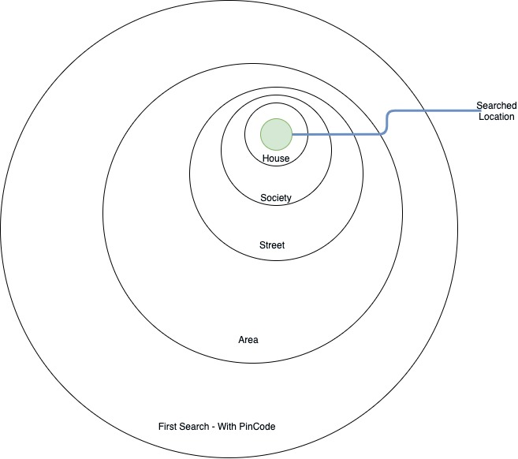

## Reverse Geocoding


Lets understand what is GeoCoding. 

### GeoCoding 

Converting between (latitude, longitude) and points of interest is called GeoCoding.

```
Latitude and Longitude are the standardized point location system to find a point on earth on a global coordinate frame. 
```


``` 15 Main 2nd Road, Ferns Society, Bangalore 560037 ```

is conveient for humans to read but very incovenvient for computers to understand so we adopted latitute and longitute to make it easier for computer to understand a location. This is called GeoCoding. 


### What is Reverse GeoCoding?

Finding out the address which is human friendly from latitude and longitude is called reverse GeoCoding. 

There are many companies which offers reverse geocoding services including Google Map API, Yahoo, Bing and Apple Maps. Most of these services are ***rate limited*** and may create a lot of issues for enterprise grade products which can't depend on these APIs. 

Lets understand how to design a system similar to system designed by Google Map reverse geocoding. 

## System Fundamental

#### DataStrcuture Definition

**Core Location (Core Location)**

- represent (lat,lon)
- plus additional info such as altitude and accuracy information.
  - timestamp
  - altitude
  - Floor
  - horizontalaccuracy
  - verticalaccuracy

**Place Mark**

- place of interest
  - ISOCountryCode
  - Country
  - postalCode
- addresses
  - AdministrativeArea
  - locality - city
  - neighbourhood
  - street
  - location
  - name
  - addressDictionary
  - inlandwater
  - ocean
  - areasOfInterest
- regions
  - region
  - Timezone


#### Service Definition

- Define the boundary of the search
  - It could be pincode in most of the cases
  - This would give the centre location to start our search in nearby area
- Create a Set (Unique Address) of PlaceMarks
  - All the different placemark will be search with the name provided by the search string.
  - Compare the properties of the placemark with the provided properties of the search string. 
  - Once a nearby location is found, the pointer should return and boundary is contracted.
- Once nearby location is found, the search restarts from the begining with contracted area until we find the searched location.
- If location is found, we return the lat,lon
  - If not, then we return he closest found location.


In real life this is how it will look, 





#### PsedoCode

```
public LatLong findLocation(Address address)
  boolean foundLocation = false;

  boolean errorInFindingLocation = false;

	Set<Location> searchInArea = new HashSet();
	if(address.buildingName != null){
		searchInArea.add(findAreas(String buildindName, Type.BuildingNameSearch));
	}else if(address.pinCode!= null){
		searchInArea.add(findAreas(String buildindName, Type.PinCodeSearch));
	}
  while(!foundLocation && !errorInFindingLocation && searchInArea.isNotEmpty()){
  		while(searchInArea.hasNext()){
  				//Match Location
  				// If Location is not matched, return the last nearby location
			}
  }
}

Address {
	String country;
  String cityName;
	String pinCode;
	String streetname;
	String area;
	String buildingName;
	String houseNumber;
}
```

